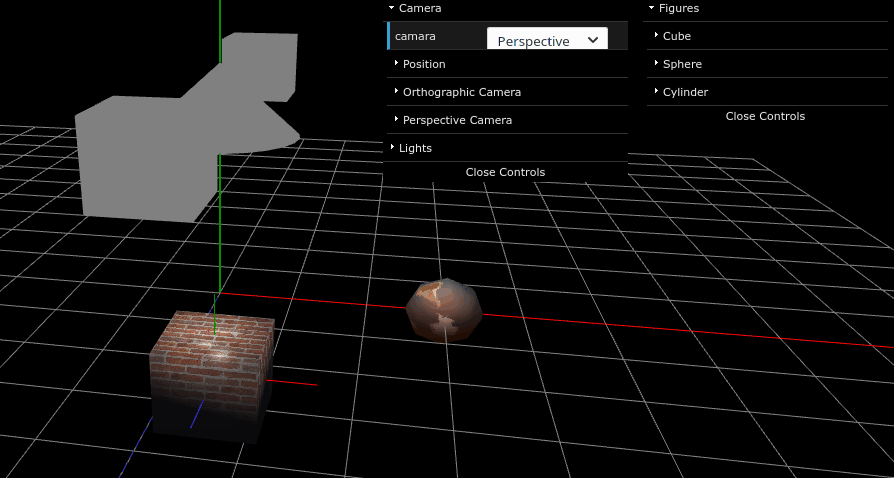
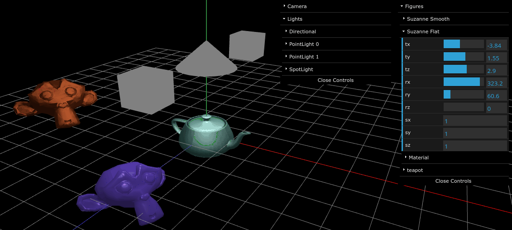

# Computer Graphics with WebGL in Javascript
This project was made for the course "Computación Gráfica y Ambientes Virtuales"
(Computer Graphics and Virtual Environments). Through it I learned how do some of the basis of this field work, namely:
* 3D and 2D graphics 
* Lights (types, shading)
* Transformations (scale, rotate, translate)
* Coordinate spaces (model, world, view, clip)
* Projections (orthographic and perspective)
* Textures
* Ray casting

## Requirements

* Npm 6.14.8

Note that you may be able to run the projects under other npm versions, but if you are having problems to start the server, then use the recommended version.
 
## To run
On the main directory (the same as this Readme), run:

`npm install`  
`npm run start`  

After a short time your web browser should open on locahost:9000, from where all the exercises can be seen by clicking the names of the respective practical works, which are at the end of the page under the title *Trabajos Practicos*. The code that is in the other sections was not coded by me, but given by the professor.

If you are faced with packages needing audit fixes, follow the instructions that *npm* gives you to apply them, although notice that they aren't needed in order to run the app.

## Samples:

### TP 5 

### TP 6

## Documentation
https://twgljs.org/docs/
http://glmatrix.net/
http://workshop.chromeexperiments.com/examples/gui
http://regl.party/api

## Demos
http://webassembly.org/demo/
